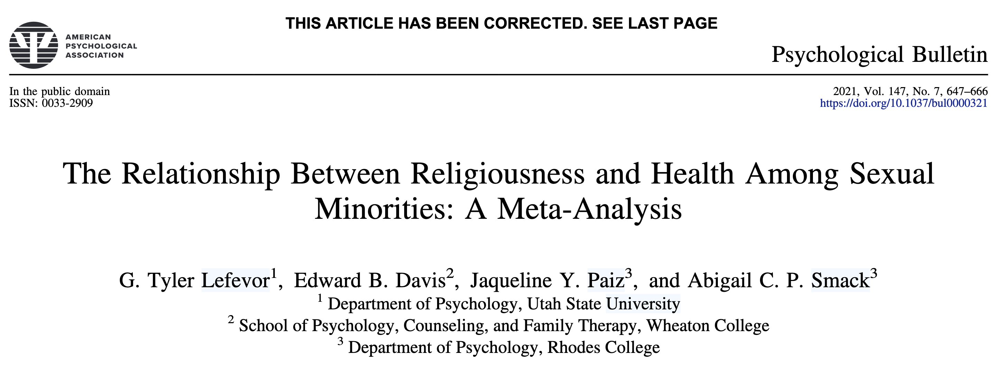

```{r include=FALSE}
pacman::p_load(here, tidyverse)
lpa_data <- readRDS(here("data", "lpa_data.Rds"))
```

## Disclosure

{width="272" fig-align="center"}

This material is based upon work supported by the National Science Foundation Graduate Research Fellowship Program under Grant No. DGE 21-46756. Any opinions, findings, and conclusions or recommendations expressed in this material are those of the author(s) and do not necessarily reflect the views of the National Science Foundation.

# Background {.unlisted .unnumbered}

## Overview

1.   Why does religion/spirituality matter for SGMs?
2.   Why focus on SGMs of Color?
3.   How is R/S engagement connected to health? 

## Health Disparities in SGMs

SGMs are at **1.50 to 4.81 higher odds** risk of experiencing:

-    internalized (e.g., depression, suicide ideation) and 
-    externalized (e.g., alcohol misuse) psychopathological symptoms 

(Liu et al., 2024; Wittgens et al., 2022; Valen et al., 2025)

## What is driving SGM health disparities?
Religiousness can contribute to SGM health disparities

### Recent studies

-   anti-LGBTQ+ religious expemption legislation (Todd et al., 2024)
-   Religiously-based family expectations (Kim et al., 2024)
-   Internal conflict (Gibbs & Goldbach, 2015)

## Religion is deeply connected to SGMs

**>78% of all SGMs are raised religions** (Lefevor et al., 2023)

**48% of all SGMs identify as religious** (Public Religion Research Institute, 2024) and highly value religion (Conron et al., 2020).

### Key Point

R/S matters to SGMs and their health.

## So is Religiousness = Bad?

**Not quite.**

{width="500" fig-align="center"}

## Recap

1.  SGMs have high health disparities
2.  Religiousness contributes to health disparities
3.  R/S and health relationship is complicated
4.  R/S is important to SGMs

### Key Question
How do SGMs engage with R/S?

## Existing studies

Prior studies focus on:

1.  Mostly White SGMs
2.  LDS or Christian only samples

### Key Gap
Even though **SGMs of Color** are more religious than White SGMs.

## Research Question

1.  How do SGMs of Color engage with R/S?
2.  Who is more likely to engage with R/S?
3.  How is this connected to health and other outcomes?

# Present Study {.unlisted .unnumbered}

## Data and Open Materials

-    Meets **Gold** Standard of Reproducibility (Heil et al., 2022)
-    Data and materials are available on Github.
-    Data is provided by the **Tyler Lefevor** and the **Public Religion Research Institute**.
-    401 of 1,253 LGBTQ+ Americans identified as BIPOC in 2023.

## Participants and Procedure (N=401)

```{r echo=FALSE}
#| fig-width: 30
#| fig-height: 13
dem_plot <- readRDS(file = here("analysis", "figures", "dem_plot.Rds"))
dem_plot +
  theme_minimal(base_size = 20)
```

## Measures Pt. 1

Behavioral Measures of R/S

-   Service Attendance (i.e., not including funerals)
-   Spiritual Activity (i.e., prayer, scripture, meditation)

Psychological Measure of Religiousness

-   Religious Commitment (i.e., intrinsic religious commitment)

Social Measure of Religiousness

-   Sense of Belonging with Religious Community

## Measures Pt. 2

Mental Health

-   PHQ-9

LGBTQ+ Measures

-   Internalized Homonegativity
-   LGBTQ+ Community Connectedness

Religious Outcome Measures

-   Religious and Sexual/Gender Internal Conflict
-   Interpersonal Religious Struggles (i.e., felt hurt by R/S people)

## Analysis Plan

-   Latent profile analysis `tidySEM` package
-   Multinomial logistic regression using profile probabilities
-   BCH distal outcome

# Results {.unlisted .unnumbered}

## Latent Profile Analysis

```{r echo=FALSE}
#| fig-width: 20
#| fig-height: 9
#| out-width: "200%"
#| out-height: "85%"
#| fig-align: "center"
lpa_plot <- readRDS(file = here("analysis", "figures", "lpa_plot.Rds"))

line_data <- ggplot_build(lpa_plot)$data[[2]]

line_styles <- line_data %>%
  group_by(group) %>%
  summarize(
    color = first(colour),
    linetype = first(linetype)
  )

p <- lpa_plot
for (i in seq_len(nrow(line_styles))) {
  g <- line_styles$group[i]
  p <- p + geom_line(
    data = filter(line_data, group == g),
    aes(x = x, y = y, group = group),
    color = line_styles$color[i],
    linetype = line_styles$linetype[i],
    linewidth = 5,
    show.legend = FALSE,
    inherit.aes = FALSE
  )
}

p +
  theme(
    # Make all text larger
    text = element_text(size = 18),           # Base text size
    axis.title = element_text(size = 30),     # Axis titles
    axis.text = element_text(size = 26),      # Axis labels
    legend.title = element_text(size = 28),   # Legend title
    legend.text = element_text(size = 26),    # Legend text
    plot.title = element_text(size = 22)) +    # Plot title (if you have one)
  guides(
    colour = guide_legend(override.aes = list(linewidth = 5, size = 4)),
    linetype = guide_legend(override.aes = list(linewidth = 5, size = 4)),
    shape = guide_legend(override.aes = list(linewidth = 5, size = 4))
  )
```

## Demographic Predictors: Gender Identity

```{r gend identity}
#| fig-width: 22
#| fig-height: 9
gen_lpa_plot <- readRDS(file = here("analysis", "figures", "gender_lpa_plot.Rds"))
gen_lpa_plot
```

## Demographic Predictors: Sexual Identity

```{r warning=FALSE}
#| fig-width: 22
#| fig-height: 9
readRDS(file = here("analysis", "figures", "sexid_lpa_plot.Rds"))
```

## Demographic Predictors: Racial/Ethnic Identity

```{r warning=FALSE}
#| fig-width: 22
#| fig-height: 9
readRDS(file = here("analysis", "figures", "racem_lpa_plot.Rds"))
```

## Outcome: Depression

```{r}
#| fig-width: 22
#| fig-height: 9
lpa_data %>%
  ggplot(aes(x = class, y = dep)) +
  stat_summary(fun = mean, geom = "col", fill = "steelblue", alpha = 1) +
  stat_summary(fun.data = mean_se, geom = "errorbar", width = 0.2, size = 1) +
  labs(
       x = "Class", 
       y = "Depression Score (Mean ± SE)") +
  theme_minimal() +
  theme(
    plot.title = element_text(size = 16, face = "bold"),
    axis.title = element_text(size = 14),
    axis.text = element_text(size = 12),
    strip.text = element_text(size = 12)  # for facet labels if needed
  )
```

## Outcome: Internalized Homonegativity

```{r}
#| fig-width: 22
#| fig-height: 9
lpa_data %>%
  ggplot(aes(x = class, y = ih)) +
  stat_summary(fun = mean, geom = "col", fill = "steelblue", alpha = 1) +
  stat_summary(fun.data = mean_se, geom = "errorbar", width = 0.2, size = 1) +
  labs(
       x = "Class", 
       y = "Internalized Homonegativity Score (Mean ± SE)") +
  theme_minimal() +
  theme(
    plot.title = element_text(size = 16, face = "bold"),
    axis.title = element_text(size = 14),
    axis.text = element_text(size = 12),
    strip.text = element_text(size = 12)  # for facet labels if needed
  )
```

## Outcome: LGBT Community Connectedness

```{r}
#| fig-width: 22
#| fig-height: 9
lpa_data %>%
  ggplot(aes(x = class, y = lgbtconnect)) +
  stat_summary(fun = mean, geom = "col", fill = "steelblue", alpha = 1) +
  stat_summary(fun.data = mean_se, geom = "errorbar", width = 0.2, size = 1) +
  labs(
       x = "Class", 
       y = "LGBT Connectedness Score (Mean ± SE)") +
  theme_minimal() +
  theme(
    plot.title = element_text(size = 16, face = "bold"),
    axis.title = element_text(size = 14),
    axis.text = element_text(size = 12),
    strip.text = element_text(size = 12)  # for facet labels if needed
  )
```

## Outcome: RS/SGI Conflict

```{r}
#| fig-width: 22
#| fig-height: 9
lpa_data %>%
  ggplot(aes(x = class, y = degreeofconflict)) +
  stat_summary(fun = mean, geom = "col", fill = "steelblue", alpha = 1) +
  stat_summary(fun.data = mean_se, geom = "errorbar", width = 0.2, size = 1) +
  labs(
       x = "Class", 
       y = "Identity Conflict Score (Mean ± SE)") +
  theme_minimal() +
  theme(
    plot.title = element_text(size = 16, face = "bold"),
    axis.title = element_text(size = 14),
    axis.text = element_text(size = 12),
    strip.text = element_text(size = 12)  # for facet labels if needed
  )
```

## Outcome: Interpersonal Religious Struggles

```{r}
#| fig-width: 22
#| fig-height: 9
lpa_data %>%
  ggplot(aes(x = class, y = irs)) +
  stat_summary(fun = mean, geom = "col", fill = "steelblue", alpha = 1) +
  stat_summary(fun.data = mean_se, geom = "errorbar", width = 0.2, size = 1) +
  labs(
       x = "Class", 
       y = "Interpersonal Religious Struggles Score (Mean ± SE)") +
  theme_minimal() +
  theme(
    plot.title = element_text(size = 16, face = "bold"),
    axis.title = element_text(size = 14),
    axis.text = element_text(size = 12),
    strip.text = element_text(size = 12)  # for facet labels if needed
  )
```

# Implications {.unnumbered}

## R/S matter to SGMs

-   Although most SGMs were NR/NS, a substantial minority are in some form.
-   Regardless of R/S engagement, all report high levels of connectedness to LGBT Community

### Key point

This reflects the broader literature, 48% of SGMs are religious, and also highly value religion. **Religion matters to SGMs.**

## R/S engagement is linked to health and identity development

-   R/S SGMs reported the lowest levels of depression
-   NR/NS reported lowest levels of internalized stigma
-   NR/NS reported lowest levels of internal conflict

### Key points

1.  R/S can promote health AND
2.  R/S can promote stressors

## Future directions

1.  Using psychometrically validated measures of religiousness and spirituality.
2.  What are the mediators driving these associations?
3.  Why do some racial/ethnic SGMs report higher R/S engagement than others?
